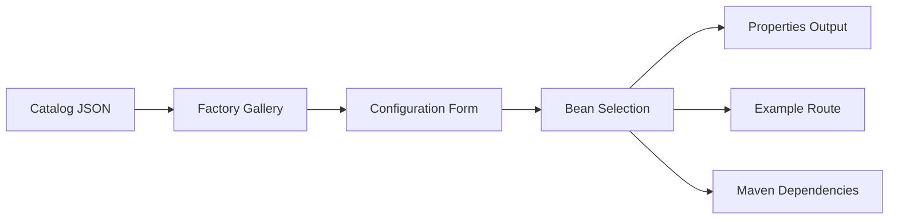

# Forage Catalog

The Forage catalog is a machine-readable metadata file that describes every factory, bean, and configuration property available in Forage. It is the foundation for tooling integration: UI designers like [Kaoto](https://kaoto.io) consume the catalog to generate wizard-like configuration pages, enabling low-code/no-code scenarios that would otherwise require manual Java bean instantiation.

## Why the Catalog Matters

Configuring a Camel integration with Forage beans requires knowing which providers exist, what properties each one accepts, which are required, and how they relate to each other. The catalog captures all of this metadata in a structured format so that tools can:

- **Generate configuration wizards** -- present factories as selectable cards, render form fields from config entries, and populate dropdowns from available beans.
- **Validate properties** -- catch typos, unknown keys, and invalid bean references before runtime (see [Property Validation](camel-jbang.md#property-validation)).
- **Resolve dependencies** -- determine which Maven artifacts to include based on the user's selections.

## Catalog Files

The build produces these files under `forage-catalog/target/generated-catalog/`:

| File | Purpose |
|------|---------|
| `forage-catalog.json` | Factories with their beans, config entries, variants, and conditional beans |
| `forage-configuration-catalog.json` | Flat list of all configuration entries grouped by module |
| `forage-catalog.schema.json` | JSON Schema (2020-12) for the catalog |
| `forage-configuration-catalog.schema.json` | JSON Schema for the configuration catalog |

YAML versions (`forage-catalog.yaml`, `forage-configuration-catalog.yaml`) are also generated.

## Generating the Catalog

```bash
mvn clean compile -f forage-catalog
```

The `forage-maven-catalog-plugin` runs during the `process-classes` phase. It scans all Forage module dependencies for `@ForageFactory` and `@ForageBean` annotations, extracts configuration entries from `ConfigEntries` subclasses, and writes the catalog files.

!!! note
    Adding a new module with the proper annotations automatically extends the catalog -- no manual catalog editing is required.

## Catalog Structure

### Top-Level Object

```json
{
  "version": "2.0",
  "generatedBy": "forage-maven-catalog-plugin",
  "timestamp": 1773133890023,
  "factories": [ ... ]
}
```

The `factories` array is the core of the catalog. Each entry describes one Forage factory and everything needed to configure and use it.

### Factory

A factory represents a high-level capability (e.g., AI Agent, DataSource, JMS Connection). Each factory maps to one or more Camel components.

```json
{
  "name": "Agent",
  "factoryType": "org.apache.camel.component.langchain4j.agent.api.Agent",
  "description": "Creates AI agents with configurable chat models ...",
  "components": ["camel-langchain4j-agent"],
  "autowired": true,
  "propertiesFile": "forage-agent-factory.properties",
  "variants": { ... },
  "configEntries": [ ... ],
  "beansByFeature": [ ... ],
  "conditionalBeans": [ ... ]
}
```

| Field | Description |
|-------|-------------|
| `name` | Display name for the factory |
| `factoryType` | Fully qualified Java type this factory produces |
| `description` | Human-readable summary |
| `components` | Camel component IDs this factory supports |
| `autowired` | If `true`, the factory can self-configure without an explicit bean name |
| `propertiesFile` | Default properties file name |
| `variants` | Platform-specific implementations |
| `configEntries` | Configuration properties for the factory |
| `beansByFeature` | Selectable bean providers grouped by feature |
| `conditionalBeans` | Beans automatically registered when a config flag is enabled |

### Variants

Each factory provides up to three platform variants so that tooling can resolve the correct Maven dependency for the user's runtime:

```json
"variants": {
  "base": {
    "className": "io.kaoto.forage.agent.AgentBeanFactory",
    "gav": "io.kaoto.forage:forage-agent:{{ forage_version }}"
  },
  "springboot": {
    "className": "io.kaoto.forage.springboot.agent.ForageAgentAutoConfiguration",
    "gav": "io.kaoto.forage:forage-agent-starter:{{ forage_version }}"
  },
  "quarkus": {
    "className": "io.kaoto.forage.quarkus.agent.deployment.ForageAgentProcessor",
    "gav": "io.kaoto.forage:forage-quarkus-agent-deployment:{{ forage_version }}"
  }
}
```

A variant may also include `additionalDependencies` -- extra GAVs required by that platform.

### Config Entries

Config entries define the properties a user can set. Each entry carries enough metadata for a UI to render the appropriate form control:

```json
{
  "name": "forage.agent.model.kind",
  "type": "bean-name",
  "description": "The model provider kind (e.g., ollama, openai)",
  "required": true,
  "label": "Model Kind",
  "configTag": "COMMON",
  "selectsFrom": "Chat Model"
}
```

| Field | Description |
|-------|-------------|
| `name` | Property key (e.g., `forage.agent.api.key`) |
| `type` | Data type -- see table below |
| `description` | Help text for the field |
| `required` | Whether the property must be set |
| `defaultValue` | Pre-populated value (optional) |
| `label` | Human-readable label for the form field |
| `configTag` | Grouping hint: `COMMON`, `ADVANCED`, or `SECURITY` |
| `selectsFrom` | For `bean-name` type -- the feature name whose beans populate the dropdown |

**Supported types:**

| `type` | UI Control | Notes |
|--------|-----------|-------|
| `string` | Text input | General-purpose text field |
| `integer` | Number input | Whole numbers |
| `double` | Number input | Decimal numbers |
| `boolean` | Toggle / checkbox | True/false flags |
| `password` | Password input | Masked text field for secrets |
| `bean-name` | Dropdown | Options populated from `beansByFeature` matching `selectsFrom` |

**Config tags** allow a UI to organize fields into expandable sections. Typically `COMMON` fields are shown expanded by default, while `ADVANCED` and `SECURITY` sections are collapsed.

### Beans by Feature

Beans represent the concrete implementations a user can choose from. They are grouped by feature so that a UI can present them as selectable options -- for example, a "Memory" dropdown offering `message-window`, `redis`, and `infinispan`.

```json
"beansByFeature": [
  {
    "feature": "Memory",
    "beans": [
      {
        "name": "infinispan",
        "description": "Distributed storage using Infinispan",
        "className": "io.kaoto.forage.memory.chat.infinispan.InfinispanMemoryBeanProvider",
        "gav": "io.kaoto.forage:forage-memory-infinispan:{{ forage_version }}",
        "propertiesFile": "forage-memory-infinispan.properties",
        "configEntries": [ ... ]
      },
      {
        "name": "redis",
        "description": "Persistent storage using Redis",
        "configEntries": [ ... ]
      },
      {
        "name": "message-window",
        "description": "Simple in-memory message window",
        "configEntries": [ ... ]
      }
    ]
  }
]
```

The link between a factory's `configEntries` and its `beansByFeature` is the **`selectsFrom`** field. When a config entry has `"type": "bean-name"` and `"selectsFrom": "Memory"`, the UI populates its dropdown from the beans in the `"Memory"` feature group. When the user selects a bean (e.g., `redis`), that bean's own `configEntries` are rendered as additional form fields.

Each bean also carries a `gav` field so that tooling can add the correct Maven dependency to the project.

### Conditional Beans

Conditional beans are automatically registered in the Camel registry when a boolean config entry is enabled. Unlike `beansByFeature` (which are user-selectable alternatives), conditional beans are activated as a group.

```json
"conditionalBeans": [
  {
    "id": "jta-transaction-policies",
    "description": "JTA Transaction Policy beans for Camel transacted routes",
    "configEntry": "forage.jdbc.transaction.enabled",
    "beans": [
      {
        "name": "PROPAGATION_REQUIRED",
        "javaType": "org.apache.camel.spi.TransactedPolicy",
        "description": "Starts a new transaction if none exists"
      },
      { "name": "MANDATORY", "..." : "..." },
      { "name": "REQUIRES_NEW", "..." : "..." }
    ],
    "runtimeDependencies": {
      "quarkus": ["mvn:io.quarkus:quarkus-narayana-jta"]
    }
  }
]
```

A conditional bean can have either a fixed `name` or a `nameFromConfig` field that references another config entry whose value becomes the bean name at runtime:

```json
{
  "nameFromConfig": "forage.jdbc.aggregation.repository.name",
  "javaType": "org.apache.camel.processor.aggregate.jdbc.JdbcAggregationRepository",
  "description": "Transactional JDBC aggregation repository"
}
```

## How the Catalog Powers UI Wizards

The catalog is designed to provide everything a UI tool needs to generate configuration wizards without Forage-specific code. Here is the flow as implemented in [Kaoto](https://kaoto.io):



### Step 1: Factory Selection

The UI reads the `factories` array and renders each factory as a selectable card showing its `name`, `description`, and supported `components`. The user picks the capability they want to configure.

### Step 2: Configuration Form

Once a factory is selected, the UI converts its `configEntries` into form fields:

- Each entry's `type` determines the control (text input, number, password, dropdown, toggle).
- Entries are grouped into expandable sections by `configTag`.
- `required` entries are validated before submission.
- `defaultValue` pre-populates fields.
- `label` and `description` provide field labels and help text.

For `bean-name` entries, the UI looks up the `selectsFrom` feature in `beansByFeature` and populates a dropdown. When the user selects a bean, its own `configEntries` appear as additional fields.

### Step 3: Multi-Instance Support

The wizard supports creating multiple instances of the same factory (e.g., two DataSources for different databases). Each instance gets a name prefix, and all property keys are prefixed accordingly:

```properties
# Instance "orders"
forage.orders.jdbc.url=jdbc:postgresql://localhost/orders
forage.orders.jdbc.username=admin

# Instance "inventory"
forage.inventory.jdbc.url=jdbc:postgresql://localhost/inventory
forage.inventory.jdbc.username=admin
```

### Step 4: Output Generation

The wizard produces:

- A **properties file** with all configured values.
- An **example Camel route** (YAML) that uses the configured factory.
- The correct **Maven dependencies** resolved from variants and bean `gav` coordinates.

## What Drives the Catalog

The catalog is entirely derived from annotations and configuration classes in the source code:

| Source | Catalog Output |
|--------|---------------|
| `@ForageFactory` on a class | Factory entry with `name`, `description`, `components`, `factoryType` |
| `@ForageFactory(variant = ...)` | Populates the `variants` map (base, springboot, quarkus) |
| `@ForageFactory(conditionalBeans = ...)` | Populates the `conditionalBeans` array |
| `@ForageFactory(configClass = ...)` | Links the factory to its config entries |
| `@ForageBean` on a class | Bean entry under the matching factory's `beansByFeature` |
| `@ForageBean(feature = "Memory")` | Groups the bean under the `"Memory"` feature |
| `ConfigModule.of(...)` | Config entry with `name`, `type`, `label`, `description`, `defaultValue`, `configTag` |
| `ConfigModule.ofBeanName(...)` | Config entry with `type: "bean-name"` and `selectsFrom` linking to a feature |

## Configuration Catalog

The build also produces `forage-configuration-catalog.json`, a flat list of all config entries grouped by module:

```json
{
  "version": "1.0",
  "generatedBy": "forage-maven-catalog-plugin",
  "timestamp": 1773133890023,
  "modules": [
    {
      "artifactId": "forage-model-open-ai-common",
      "groupId": "io.kaoto.forage",
      "propertiesFile": "forage-model-openai.properties",
      "configEntries": [ ... ]
    }
  ]
}
```

This flat view is used by the [property validator](camel-jbang.md#property-validation) and by tooling that needs a complete list of all known properties without the factory/bean hierarchy.

## Programmatic Access

The catalog model classes are available as a Maven dependency:

```xml
<dependency>
    <groupId>io.kaoto.forage</groupId>
    <artifactId>forage-catalog-model</artifactId>
    <version>{{ forage_version }}</version>
</dependency>
```

Key classes in `io.kaoto.forage.catalog.model`:

| Class | Description |
|-------|-------------|
| `ForageCatalog` | Root object with `factories` list |
| `ForageFactory` | Factory with variants, config entries, beans, conditional beans |
| `ForageBean` | Bean provider with its own config entries and GAV |
| `ConfigEntry` | Single configuration property with type, label, tag |
| `FeatureBeans` | Groups beans under a named feature |
| `FactoryVariants` / `FactoryVariant` | Platform-specific implementation info |
| `ConditionalBeanGroup` / `ConditionalBeanInfo` | Beans conditionally registered via a config flag |
| `ForageConfigurationCatalog` / `ConfigurationModule` | Flat configuration catalog model |

These classes can be deserialized from the catalog JSON using Jackson.
